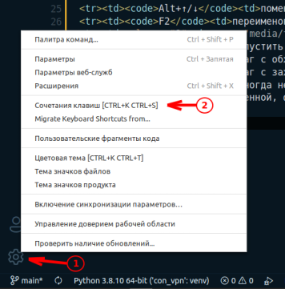
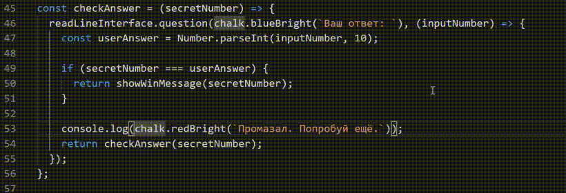

Тема значков: Material Icon Theme
Цветовая схема: Atomize (Atom One Dark theme)

Русификация: Russian Language Pack for Visual Studio Code

<table>
<tr><th colspan="2">Плагины для VSCode</th></tr>
  <tr>
    <td>Python от Microsoft</td>
    <td>Two</td>
  </tr>
  <tr>
    <td>pylint</td>
    <td>статический анализатор кода</td>
  </tr>
</table>

<table>
<tr><th colspan="2"><a href="https://code.visualstudio.com/shortcuts/keyboard-shortcuts-windows.pdf">Горячие клавиши VSCode </a></th></tr>
<tr><td colspan="2">Для того, чтобы настроить свои "горячие клавиши" откройте "Файл"-"Настройки"-"Сочетания клавиш" </td></tr>
<tr><td><code>Ctrl+B</code></td><td>показать/скрыть боковую панель</td></tr>
<tr><td><code><code>Ctrl+`</code> или <code>Ctrl+J</code></td><td>включить/выключить терминал</td></tr>
<tr><td><code>Ctrl+/</code></td><td>комментировать/раскоментировать строки</td></tr>
<tr><td><code>Ctrl+Shift+\</code><td>перейти к парной скобке</td></tr>
<tr><td><code>Alt+↑/↓</code><td>поменять строки местами</td></tr>
<tr><td><code>F2</code><td>переименовать переменную глобально везде, где она встречается</td></tr>
<tr><td colspan="2"></td></tr>
<tr><td><code>F5</code><td>запустить отладку</td></tr>
<tr><td><code>F10</code><td>шаг с обходом</td></tr>
<tr><td><code>F11</code><td>шаг с заходом</td></tr>
<tr><td><code>F12</code><td>Иногда непонятно, откуда взялась переменная.<code>F12</code> переместит курсор к объявлению выделенной переменной, функции или метода, даже если они объявлены в другом файле</td></tr>
</table>
