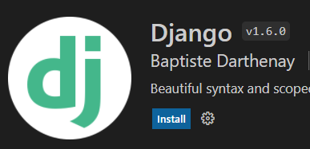

<H2 align="center">Настройка VSCode для использования с Python и Django</H2>
  
 Перед установкой VSCode нужно установить Python. Смотрите подробную инструкцию <a href="https://python-scripts.com/install-python-windows">как это сделать</a> 
<table>
<tr><th colspan="2" style="text-align:center">Плагины для VSCode</th></tr>
  <tr><td><code>Python от Microsoft</code></td><td align="justify">поддержка языка Python, включая такие функции, как IntelliSense (Pylance), линтинг, отладка, навигация по коду, форматирование кода, рефакторинг, проводник переменных, обозреватель тестов...</td></tr>
  <tr><td><code>pylint</code></td><td>статический анализатор кода</td></tr>
  <tr><td><code>Russian Language Pack</code></td><td>Русификация VSCode</td></tr>
  <tr><td><code>Django</code> <code>(Baptiste Darthenay)</code> </td><td> Имеет полезные подсказки: </td></tr>
  <tr><td><code>Bracket Pair Colorizer 2</code></td><td>подсвечивает парные скобочки</td></tr>
  <tr><td><code>Night Owl</code>, <code>Material Icon Theme</code>, <code>Atomize (Atom One Dark theme</code></td><td>Неплохие цветовые темы и значки</td></tr>
  <tr><td><code></code></td><td></td></tr>
</table>

<table>
<tr><th colspan="2"><a href="https://code.visualstudio.com/shortcuts/keyboard-shortcuts-windows.pdf">Горячие клавиши VSCode </a></th></tr>
<tr><td><code><code>Ctrl+`</code> или <code>Ctrl+J</code></td><td>включить/выключить терминал</td></tr>
<tr><td><code>Ctrl+/</code></td><td>комментировать/раскоментировать строки</td></tr>
<tr><td><code>Ctrl+Shift+\</code><td>перейти к парной скобке</td></tr>
<tr><td><code>Alt+↑/↓</code><td>поменять строки местами</td></tr>
<tr><td><code>F2</code><td>переименовать переменную глобально везде, где она встречается</td></tr>
<tr><td colspan="2"></td></tr>
<tr><td><code>F5</code><td>запустить отладку</td></tr>
<tr><td><code>F10</code><td>шаг с обходом</td></tr>
<tr><td><code>F11</code><td>шаг с заходом</td></tr>
<tr><td><code>F12</code><td>Иногда непонятно, откуда взялась переменная.<code>F12</code> переместит курсор к объявлению выделенной переменной, функции или метода, даже если они объявлены в другом файле</td></tr>
<tr><td colspan="2">Для того, чтобы настроить свои "горячие клавиши" откройте "Файл"-"Настройки"-"Сочетания клавиш" </td></tr>
<tr><td><code>Ctrl+B</code></td><td>показать/скрыть боковую панель</td></tr>
</table>

<table>
<tr><th style="text-align:center">Настройка VSCode</th><tr>
<tr>
    <td align="justify">
        Нажав комбинацию клавиш <code>Ctrl+,</code> заходим в настройки и меняем следующие параметры): 
        <code><pre>{
"python.pythonPath": "venv\\Scripts\\python.exe",
"editor.formatOnSave": true,
"python.formatting.provider": "autopep8",
"python.linting.enabled": true,
"python.linting.lintOnSave": true,
"files.associations": {
"**/*.html": "html",
"**/templates/**/*.html": "django-html",
"**/templates/**/*": "django-txt",
"**/requirements{/**,*}.{txt,in}": "pip-requirements"
},
}</pre></code> P.S.<b>путь к Python нужно указать свой</b>
    </td>
</tr>
</table>